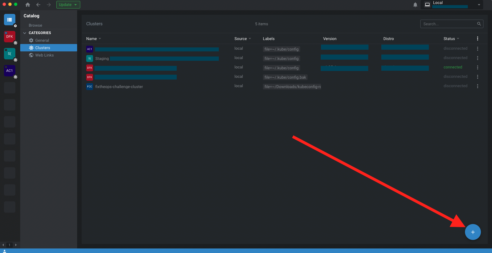

# How to connect with a kubeconfig file

> THIS IS WORK IN PROGRESS, thanks for the patience.

Downloading the kubeconfig file will allow you to access the cluster from anywhere, thus allowing you to use the tools you prefer: Lens, K9s, your terminal, etc.

You can use the kubeconfig in several ways, here are some listed below.

## Lens (recommended)

Using Lens, a kubernetes GUI, you can really easily use a kubeconfig that you just downloaded.

1. [Download](https://k8slens.dev/) & open Lens
2. Go to the catalog on top left, then click on the "+" button to add the kubeconfig
3. select the downloaded kubeconfig "fixtheops-challenge-cluster"
4. click on the new added cluster



## K9s (recommended)

You don't like GUI? Fine, [k9s](https://k9scli.io/) is amazing. Here is how to start it with the newly downloaded kubeconfig:

```sh
k9s --kubeconfig ~/Downloads/fixtheops-challenge-cluster
```

## kubectl

### With the command line

```sh
kubectl --kubeconfig=~/Download/kubeconfig get pods
```

### With a variable

```sh
export KUBECONFIG=~/Download/kubeconfig
# it will then by the default in the current shell
```

### Merge the config with your current kubeconfig

Merge the downloaded kubeconfig to your own kubeconfig. You can check the [official documentation](https://kubernetes.io/docs/concepts/configuration/organize-cluster-access-kubeconfig/#merging-kubeconfig-files).

### Create a new alias

If you don't persist the alias in a dotfile or config file, it would only be available in the current shell session.

```sh
alias k="kubectl --kubeconfig=~/Download/kubeconfig"
# or alias for FixTheOps
alias fto="kubectl --kubeconfig=~/Download/kubeconfig"

k get pods
# or
fto get pods
```

## With Helm

```sh
helm install my-release my-repo/app --kubeconfig=~/Download/kubeconfig
```